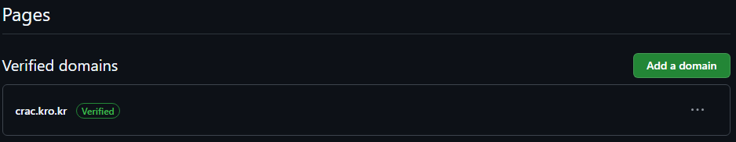

# Crack을 위한 간단한 외부이미지 서버

###  Q. 이 사이트는 정체가 뭔가요?
#### A. Github Pages를 활용해 만든 간이 이미지 서버이며 아래와 같은 형태로 사용할수 있습니다
```


ex) 
```
---

###  Q. 기존 Github 방식과 어떤점이 다른건가요?
#### A. 링크가 매우 짧아지기에 토큰량에 있어 유리합니다
```
82자 (27토큰) https://raw.githubusercontent.com/Haruna5718/CrackImage/refs/heads/main/Haruna.png
->
30자 (14토큰) https://crac.kro.kr/Haruna.png
```
---

###  Q. 비용이 발생하거나 제약이 있는건가요?
#### A. 비용은 일절 발생하지 않는 방법을 기준으로 설명하며 도메인 갱신 이외의 추가 작업은 필요하지 않습니다
---

###  Q. 방법이 많이 어려운가요?
#### A. 설명을 따르기만 하면 되기에 많이 어렵지 않습니다.
---

###  Q. 그럼 대체 어떻게 하는건가요?

### 목차
1. 도메인 선점하기
2. Github에 도메인 추가하기
3. Repository 생성하고 Pages 활성화하기
4. Pages에 도메인 연결하기

---
<br><br>

# 1. 도메인 선점하기


도메인을 구하는 방법은 아주 여러가지가 있지만 해당 튜토리얼에서는 각종 `.kr`의 서브도메인을 무료로 제공하는 [내도메인.한국](https://내도메인.한국)을 사용합니다


로그인 후 화면 중앙에 원하는 도메인을 검색후 등록하기를 클릭합니다

본 튜토리얼에서는 `crac.kro.kr`을 사용해 진행합니다


등록후엔 위와같은 설정 화면으로 이동됩니다

당장은 설정할것이 없으므로 탭은 잠시 뒤로 치워둡니다

### 주의사항


`내도메인.한국`에서 제공하는 도메인은 무료인 대신 3개월후 만료됩니다

도메인이 만료되는것을 막으려면 만료되기 30일 전부터 가능한 기간 연장을 통해 기간을 늘려줘야 합니다

별도의 비용이 발생하지 않으며 `도메인 관리`페이지에서 빨간색으로 바뀐 만료일 날짜를 눌러 연장할 수 있습니다

# 2. Github에 도메인 추가하기


Github에서 [프로필 -> Settings -> Pages](https://github.com/settings/pages)로 이동합니다

 버튼을 클릭 후 앞 단계에서 등록한 도메인을 입력합니다


도메인 입력 후  버튼을 클릭합니다


화면상에 표시되는 1번과 2번의 값을 각각 복사합니다


이전 단계에서 뒤로 치워둔 도메인 설정탭을 다시 꺼내와 위와 같이 입력합니다

`고급설정 (DNS) > TXT`에서 각각의 칸은 

- 앞쪽: 복사한 1번값의 `_github-pages-challenge-Haruna5718.crack`에서 `.crack`을 제외한 `_github-pages-challenge-Haruna5718`
- 뒤쪽: 복사한 2번값인 `0a3216822914245296df9845d71efc`

을 입력 후 `보안코드`를 입력하고  버튼을 클릭해 저장합니다

\* 각 입력칸에 입력하는 값은 자신의 상황에 맞게 입력해야 합니다



이후 다시 Github창으로 돌아와  버튼을 클릭하면 계정에 도매인이 등록됩니다

# 3. Repository 생성하고 Pages 활성화하기


[Repository 생성 페이지](https://github.com/new)에서 새 Repository를 생성합니다

이때 반드시 공개로 생성해야 Pages를 무료로 사용할 수 있습니다


`README`를 눌러 `README.md`파일을 생성합니다

이는 이후 설정과 성공여부 확인에 해당 파일이 필요해서이며 추후 삭제해도 무관합니다


 버튼을 누른 후  버튼을 눌러 저장합니다


생성된 Repository에서 `Settings > Pages`탭으로 이동합니다


`Branch` 항목을 다음과 같이 맞추고  버튼을 눌러 저장합니다

# 4. Pages에 도메인 연결하기


아래에 새로 생긴 `Custom domain`항목에 앞서 등록한 도메인을 입력합니다

```
Custom domains allow you to serve your site from a domain other than haruna5718.github.io. Learn more about configuring custom domains.
```

위와같이 적혀있는 설명에서 `haruna5718.github.io`에 해당하는 부분을 복사합니다


뒤로 치워뒀던 도메인 설절 페이지로 돌아가서 `고급설정 (DNS) > CNAME`에 방금 복사한 `haruna5718.github.io`를 입력합니다

`보안코드`를 입력하고  버튼을 클릭해 저장합니다


이후  버튼을 눌러 저장합니다


틀린 과정이 없었다면 다음과 같이 성공했대는 안내 문구가 나옵니다

`Enforce HTTPS`가 꺼져있다면 켜줍니다


이후 설정한 도메인으로 접속했을때 위와같은 `README.md` 파일의 내용이 나온다면 성공입니다

이후부턴 사용할 이미지 파일을 업로드 후 `https://crac.kro.kr/Haruna.png` 와 같이 `https://도메인/파일경로`의 형태로 사용하면 됩니다